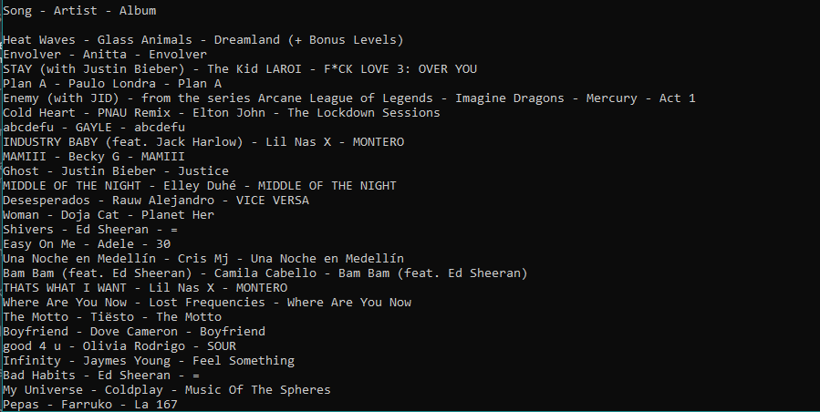

# Perfect PlayLsit
The Perfect Playlist is for Spotify user, who are seeking new music to listen to in a more absract way. It'll allow the user to input an image and based off that image, it'll generate a recommended playlist. 


# How to run
```
- Download the latest binary from the Release section on the right on GitHub.  
  See releases tag https://github.com/cis3296s22/PerfectPlaylist/releases/tag/0.1.1
```
 
- On the command line uncompress using
```
*Only follow this step if installing direclty from source.
tar -xzf PerfectPlaylist-0.1.1
```
- On the command line run with
```
clone the repository and cd into the project directory

- It is recomended to test inside a virtual envronment to avoid global python packages installs

first run: pip install -r requirements.txt in your shell.

then start the program with: python ./perfect_playlist.py
```
- the user will be presented with the playlist query results in json format. 

# How to contribute
Follow this project board to know the latest status of the project: [Trello]([https://trello.com/b/zeHItZVV/perfectplaylist)  

### How to build
- Use this github repository: [Github](https://github.com/cis3296s22/PerfectPlaylist/tree/hello-world) 
- Specify what branch to use for a more stable release or for cutting edge development: use hello-world branch for runnable build.
- Use python 3
- must install imageio and spotipy packages this ca be done by folloing the command line install instructions
- What file and target to compile and run. 
- The when the program starts the user is prompted to hit enter, 
  the user will be presented with the playlist query results in json format, 
  the user will be asked to hit enter to exit the program.

